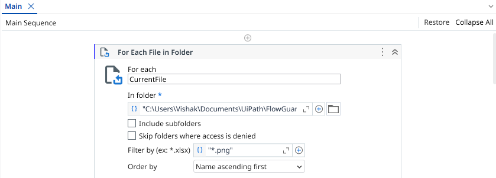
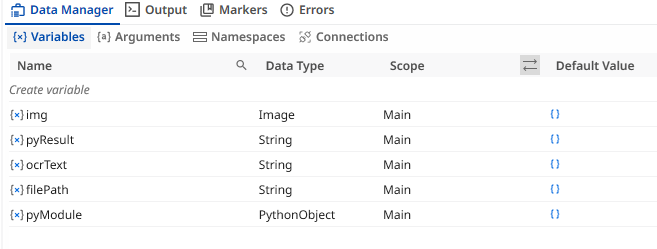
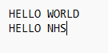
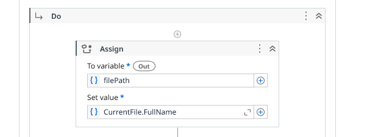
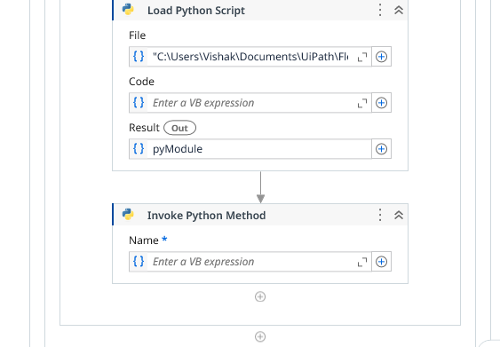
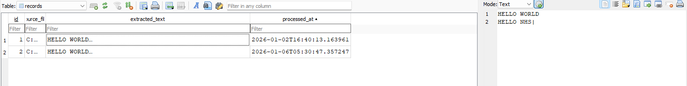

# FlowGuardRPA

**End-to-End Document Automation using UiPath, OCR, Python, and SQLite**

## Overview

**FlowGuardRPA** is an end-to-end **Robotic Process Automation (RPA)** pipeline that automates the processing of scanned documents (image files) into structured, stored data.

The pipeline:
- Monitors a folder for incoming image files  
- Extracts text using Tessarct OCR  
- Passes the extracted text to Python for processing  
- Stores results in a SQLite database for further analysis  

This project demonstrates how manual, repetitive document handling can be replaced with a reliable and cost-effective automation flow.

## Why this pipeline is useful

Many organisations still rely on:
- Scanned or photographed documents  
- Manual data entry  
- Inconsistent record keeping  

This pipeline:
- Removes manual transcription  
- Improves consistency  
- Creates an audit trail  
- Enables easy review and reprocessing  

It is especially relevant for **administrative, compliance, and public sector workflows**.

**UiPath** is a Robotic Process Automation (RPA) platform used to automate repetitive, rule based tasks across systems.

**OCR (Optical Character Recognition)** is the technology that allows a computer to read text from images. 
In this project, OCR is used to extract readable text from `.png` image files, such as scanned 
documents or screenshots. FlowGuardRPA uses **Tesseract OCR**, which works completely offline 
and is free to use. The extracted text is then passed into the automation pipeline for 
storage and further processing.

**SQLite** is a lightweight, file based database that stores data directly in a single `.db` file. 
In FlowGuardRPA, SQLite is used to save the OCR results along with the source file name and 
the time the file was processed. It does not require any server setup, user accounts, 
or network connection, which makes it fast and easy to use. 

In this project, UiPath acts as the **orchestration layer**, coordinating:
- File handling  
- OCR execution  
- Python processing  
- Data persistence using SQLite

- **Flow** — Represents an end-to-end process flow  
- **Guard** — Ensures data is captured, logged, and traceable  
- **RPA** — Robotic Process Automation  

The name "FlowGuardRPA" reflects a pipeline that guards operational workflows by automating them reliably.

## Architecture

**1. File Intake**

*Image 1* - Start of the Main Sequence For Each file in folder activity

*Image 2* - Variables

*Image 3* - Sample Input .png file

The sequence begins with a For Each File in Folder Activity set to scan for .png files as shown in Image 1 which is configured to the input_docs folder. 
Also, multiple variables are set as shown in Image 2 which are then used in various stages throughout the Sequence.
Image 3 shows a sample input of a png input file, meant to emulate scanned paper documents.

**2. Image Loading & OCR**

*Image 4* - Image Loading and OCR Activities in the Pipeline Sequence

Then, the input image is ingested and loaded using the Assign and Load Image Activities as shown in Image 4.
This loaded image is scanned with the Tessaract OCR Activity and the scanned text is loaded into the OCRText Variable for further use.

**3. Python Integration and DB Push**

*Image 5* - Python Steps in the Pipeline Sequence

*Image 6* - Sample output stored in the Local db file

Lastly, Python is scoped inside Uipath using the Scope Python Activity where we map the Local paths of Installed Python into the necessary space. 
Later, the main python file (process_ocr_output.py in /python folder) is loaded and the particular method "process_ocr()" is invoked while sending the OcrTExt and nput Image file path as method parameters using the 
Load Python File and Invoke Python method activities respectively (Image 5). The method in the python file connects to the SQLite DB, creates a new table and stores the OCR text, Time and Image path with an Automatic incremental Primary Key. 
When the data is pushed successfully, we can this in the table as seen in Image 6.

## How the Pipeline Works in a nutshell

1. Image files are placed in a monitored input folder  
2. UiPath loads each image and extracts text using OCR  
3. Extracted text is passed to a Python function  
4. Python stores the data in a SQLite database with timestamps  
5. Each run produces a traceable record of processed documents  

## How to Run the Project

### Prerequisites
- UiPath Studio (Community Edition)  
- Python 3.10 (64-bit)  
- DB Browser for SQLite (optional, for inspection)

### Steps to Run

1. Open UiPath Studio  
2. Load `Main.xaml` from this repo 
3. Ensure Python Scope is configured for Python 3.10  
4. Place `.png` input images into the configured input folder  
5. Click **Run**  

- The database file (`flowguard.db`) is created automatically on first execution.
- The pipeline uses **SQLite** for lightweight local persistence  

Each record stores:
- Source file path  
- Extracted OCR text (trimmed)  
- Processing timestamp

